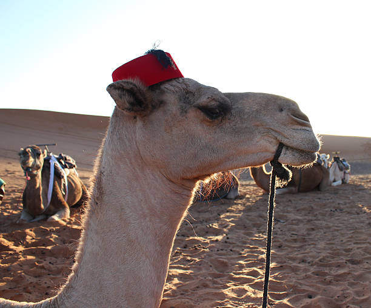

## Heritage camel

## 🕹️ Description

> This application is a website where you can list heritage sites you have been to, a full CRUD application with user auth
and the ability to create comments under the posts you like.

## 🚀 Getting Started

**Use the app here:** [Deployed Application link](https://your-deployment-link.com)

**Project Planning Materials:**  
- [Wireframes](./planning/wireframes.png)  
- [User Stories](./planning/user-stories.md)  
- [Trello Board](https://trello.com/your-board)

## 💡 Technologies Used

- HTML
- CSS
- JavaScript
- Bootstrap
- EJS
- Express

## 🚧 Next Steps

- Optimize code and stability
- add a favorites option for users to favorite their favorite posts
- Add more animations 
- Make it mobile-friendly
